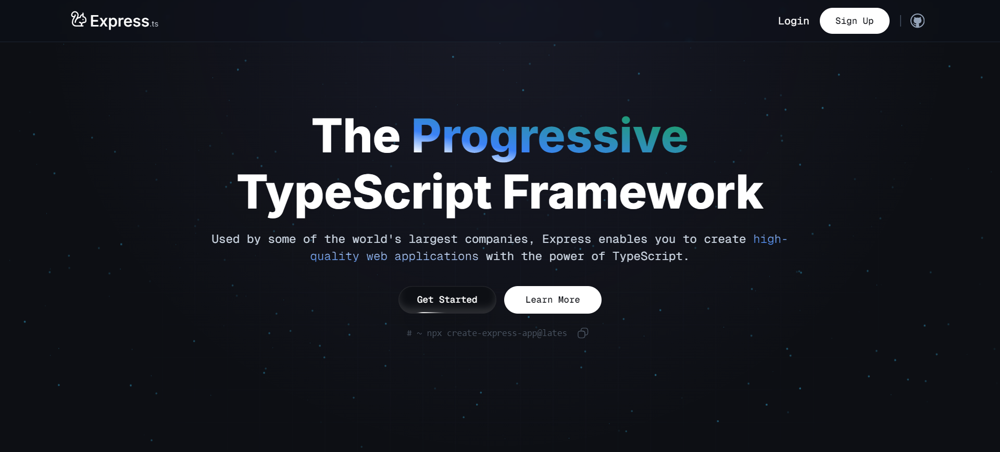
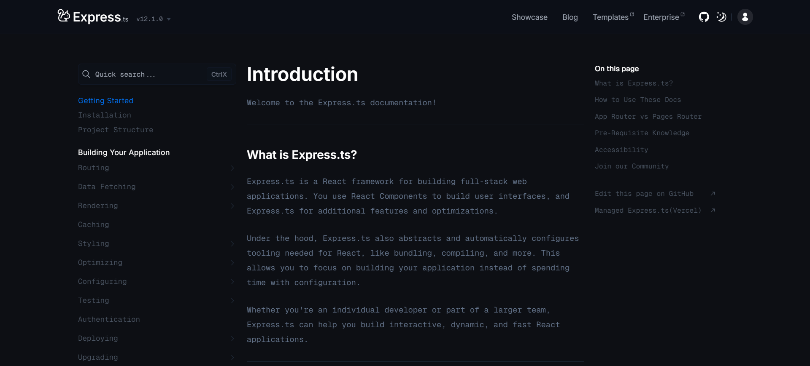

# <h3 align="center">Express | NextJs</h3>

<h4 align="center">Welcome to the Express.ts project repository! We are here to show you an incredible website template for web framework!</h3>

[](https://express-next-js.vercel.app)
[](https://express-next-js.vercel.app)

## 🤖 About Express

📋 This is a beautiful and very simple template for web-framework. This is just template and it consists only of a main page and a beautiful documentation page. Also this website has Two-Factor authentication when using NextAuth and Prisma for db.

## 🛠 Technologies Used

We've assembled quite the tech stack to bring Express to life:

- [React](https://react.dev/)
- [NextJs](https://nextjs.org/)
- [TypeScript](https://www.typescriptlang.org/)
- [Scss](https://sasscss.org/)

**Libraries:** [`TailwindCss`](https://tailwindcss.com/), [`NextUI`](https://nextui.org/),[`Framer Motion`](https://www.framer.com/motion/), [`ShadcnUI`](https://ui.shadcn.com/),[`Prisma`](https://www.prisma.io/),[`Atropos`](https://atroposjs.com/), [`NextAuth`](https://next-auth.js.org/), [`Resend`](https://resend.com/), [`Zod`](https://zod.dev/)`

## 🚀 Getting Started

To get this project up and running on your local machine, follow these steps:

- Clone the repository
- Install dependencies with `npm install`

```bash
 npm install
```

- Run the development server with `npm run dev`

```bash
 npm run dev
```

- Open your browser and navigate to `http://localhost:3000`

## 📜 Disclaimer

Express.ts is a fictional company created for demonstration purposes only. Any resemblance to real companies, living or dead, is purely coincidental.

## 🤝 Contributing

While Express isn't a real company, your contributions to this project are real and valued! Feel free to open issues or submit pull requests if you have ideas for improvements. Thank you!
